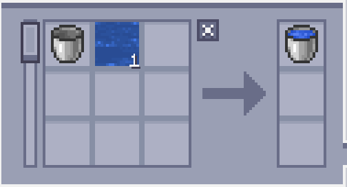
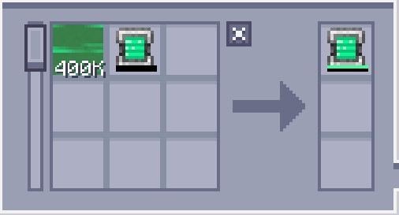

---
navigation:
    parent: epp_intro/epp_intro-index.md
    title: Envasadora ME
    icon: extendedae:caner
categories:
- extended devices
item_ids:
- extendedae:caner
---

# Envasadora ME

<BlockImage id="extendedae:caner" scale="8"></BlockImage>

¡La envasadora ME es una máquina que "envasa" cosas, incluyendo fluidos, gas del Mekanism, maná del Botania e incluso energía!

La primera ranura es para lo que se va a llenar y la segunda ranura es para con qué se va a llenar.

Necesita energía para funcionar y cada operación cuesta 80 AE.

Solo se llena fluidos por defecto, necesita instalar el addon correspondiente para llenarlo con otras cosas.

### Addons soportados:
- Applied Flux
- Applied Mekanistics
- Applied Botanics Addon

## Auto-fabricación con envasadora ME

Solo el lado superior e inferior puede aceptar energía y conectarse a la red.

<GameScene zoom="6" background="transparent">
  <ImportStructure src="../structure/caner_example.snbt"></ImportStructure>
</GameScene>

Una configuración simple para la envasadora ME. La envasadora ME expulsará automáticamente el objeto lleno cuando acepte los ingredientes del <ItemLink id="ae2:pattern_provider" />.

<GameScene zoom="6" background="transparent">
  <ImportStructure src="../structure/caner_auto.snbt"></ImportStructure>
</GameScene>

El patrón solo debe contener las cosas a llenar y el recipiente a llenar. Aquí hay algunos ejemplos:

Llenar el cubo de agua:

Tableta de energía de poder (Necesita Applied Flux instalado):

## Vaciado

La envasadora ME también puede vaciar cosas de un contenedor en modo vacío. Necesitas cambiar las entradas y salidas en el patrón.
