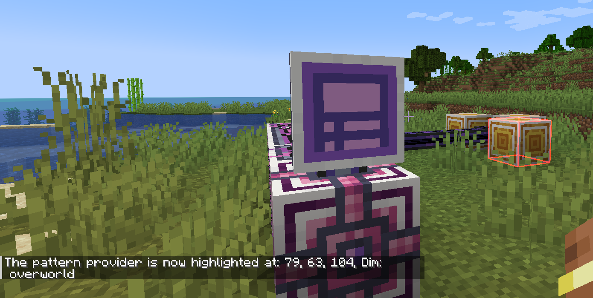

---
navigation:
    parent: epp_intro/epp_intro-index.md
    title: Terminal de acceso a patrones ME extendido
    icon: extendedae:ex_pattern_access_part
categories:
- extended devices
item_ids:
- extendedae:ex_pattern_access_part
- extendedae:wireless_ex_pat
---

# Terminal de acceso a patrones ME extendido

La terminal de acceso a patrones ME extendido proporciona 3 funciones adicionales en comparación con una <ItemLink id="ae2:pattern_access_terminal" />.

<Row gap="20">
<GameScene zoom="6" background="transparent">
<ImportStructure src="../structure/cable_ex_pattern_terminal.snbt"></ImportStructure>
<IsometricCamera yaw="180"></IsometricCamera>
</GameScene>
<ItemImage id="extendedae:wireless_ex_pat" scale="4"></ItemImage>
</Row>

## Mejor búsqueda de patrones

Puedes buscar patrones por el nombre de los ingredientes de entrada/salida.

## Resaltado de patrones

A veces todavía es difícil encontrar el patrón deseado porque los patrones siempre se muestran como un grupo. Ahora la
terminal de acceso a patrones extendida puede resaltar el patrón coincidente en la interfaz gráfica.

## Resaltado del proveedor de patrones en el mundo

Es molesto descubrir qué proveedor de patrones está atascado al realizar grandes trabajos de fabricación. La terminal de acceso a
patrones extendida puede resaltar el proveedor de patrones en el mundo, para que puedas localizarlo fácilmente.

