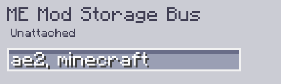

---
navigation:
    parent: epp_intro/epp_intro-index.md
    title: Bus de almacenamiento ME de mods
    icon: extendedae:mod_storage_bus
categories:
- extended devices
item_ids:
- extendedae:mod_storage_bus
---

# Bus de almacenamiento ME de mods

<GameScene zoom="8" background="transparent">
  <ImportStructure src="../structure/cable_mod_storage_bus.snbt"></ImportStructure>
</GameScene>

El bus de almacenamiento ME de mods es un <ItemLink id="ae2:storage_bus" /> que se puede filtrar por nombre de mod o id de mod.

Usa coma para separar varios ids de mods en caso de que quieras filtrar varios mods.

