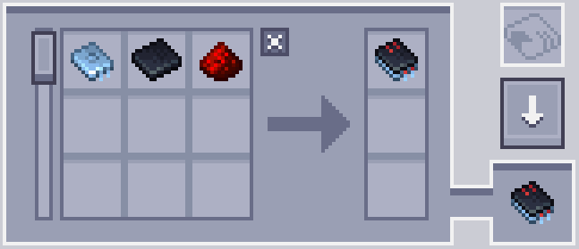
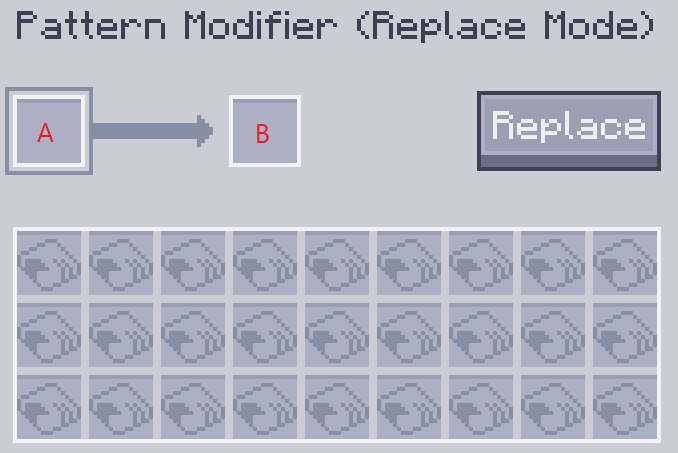

---
navigation:
    parent: epp_intro/epp_intro-index.md
    title: Modificador de patrones
    icon: extendedae:pattern_modifier
categories:
- extended items
item_ids:
- extendedae:pattern_modifier
---

# Modificador de patrones

El modificador de patrones es una herramienta para la modificación masiva de patrones.

<ItemImage id="extendedae:pattern_modifier" scale="4"></ItemImage>

Haz clic derecho para abrir su interfaz.

## Modo multiplicar

Puedes multiplicar/dividir la cantidad de entrada y salida del patrón de procesamiento por x haciendo clic en el botón correspondiente.

Patrón de origen:

Después de x10:

También puede borrar todo el contenido de los patrones y convertirlos en patrones en blanco haciendo clic en el botón borrar.

### Notas:

 - La división solo funciona cuando la cantidad es divisible. Por ejemplo, el botón ÷2 no funcionará cuando el patrón requiera 3x
de roca como entrada, porque 3÷2 es 1.5.

 - El botón de multiplicación tiene un límite (999999). No puede hacer que la cantidad de un solo ingrediente supere este número.

## Modo reemplazar

Reemplazar cierto ingrediente de entrada y salida del patrón con otro objeto.

La ranura A es lo que se reemplazará y la ranura B es con lo que se reemplazará el objetivo.

Por ejemplo, la siguiente configuración reemplazará el tablón con carbón.

Haz clic en el botón reemplazar para realizar el reemplazo.

## Modo propiedad

Modificar el modo de sustituciones y sustituciones de fluidos del patrón de fabricación.

## Modo clonar

Puedes hacer una copia de cualquier patrón dado en este modo.

