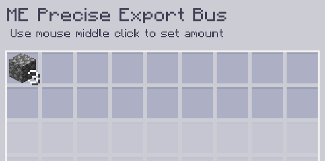
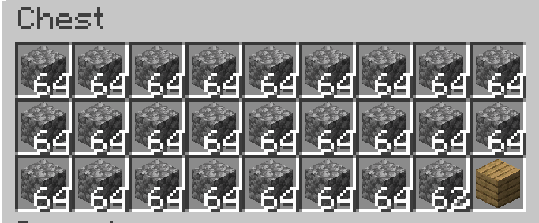

---
navigation:
    parent: epp_intro/epp_intro-index.md
    title: Bus de exportación ME preciso
    icon: extendedae:precise_export_bus
categories:
- extended devices
item_ids:
- extendedae:precise_export_bus
---

# Bus de exportación ME preciso

<GameScene zoom="8" background="transparent">
  <ImportStructure src="../structure/cable_precise_export_bus.snbt"></ImportStructure>
</GameScene>

El bus de exportación ME preciso exporta objetos/fluidos en cantidades específicas. Solo exporta si el contenedor puede aceptar completamente toda la salida.

## Ejemplo

Esto significa exportar 3 piedras por operación. Deja de exportar cuando la cantidad de piedras es inferior a 3 en la red.

También deja de exportar cuando el contenedor de destino no puede contener todo lo que exportó. El cofre solo puede contener 2 piedras más ahora, por lo que el bus de exportación se detiene.
