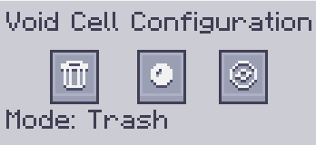

---
navigation:
    parent: epp_intro/epp_intro-index.md
    title: Celda ME de vacío
    icon: extendedae:void_cell
categories:
- extended items
item_ids:
- extendedae:void_cell
---

# Celda ME de vacío

Un condensador de bolsillo en la unidad.

<ItemImage id="extendedae:void_cell" scale="4"></ItemImage>

La celda de vacío necesita ser particionada en el <ItemLink id="ae2:cell_workbench" /> antes de usarla. Eliminará todo lo que
coincida con su filtro o los condensará en <ItemLink id="ae2:matter_ball" /> o <ItemLink id="ae2:singularity" /> como un <ItemLink id="ae2:condenser" />.

Haz clic derecho para abrir la interfaz de configuración.

