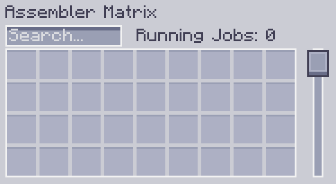

---
navigation:
    parent: epp_intro/epp_intro-index.md
    title: Matriz ensambladora
    icon: extendedae:assembler_matrix_frame
categories:
- extended devices
item_ids:
- extendedae:assembler_matrix_frame
- extendedae:assembler_matrix_wall
- extendedae:assembler_matrix_glass
- extendedae:assembler_matrix_pattern
- extendedae:assembler_matrix_crafter
- extendedae:assembler_matrix_speed
---

# Matriz ensambladora

<Row>
<BlockImage id="extendedae:assembler_matrix_frame" p:formed="true" p:powered="true" scale="5"></BlockImage>
<BlockImage id="extendedae:assembler_matrix_wall" scale="5"></BlockImage>
<BlockImage id="extendedae:assembler_matrix_glass" scale="5"></BlockImage>
</Row>
<Row>
<BlockImage id="extendedae:assembler_matrix_pattern" scale="5"></BlockImage>
<BlockImage id="extendedae:assembler_matrix_crafter" scale="5"></BlockImage>
<BlockImage id="extendedae:assembler_matrix_speed" scale="5"></BlockImage>
</Row>

La matriz ensambladora es una estructura multibloque. Es una combinación del <ItemLink id="ae2:molecular_assembler" /> y el <ItemLink id="ae2:pattern_provider" />.
Puede ejecutar muchos trabajos de fabricación al mismo tiempo (con suficientes <ItemLink id="ae2:crafting_accelerator" /> en su red ME) y ahorrar canales para usted.

## Estructura

<GameScene zoom="3" background="transparent" interactive={true}>
  <ImportStructure src="../structure/assembler_matrix.snbt"></ImportStructure>
</GameScene>

Es un prisma rectangular, con longitudes de borde entre 3 y 7.
- Los bordes están compuestos por marco de matriz ensambladora.
- Las caras están compuestas por pared/vidrio de matriz ensambladora.
- El interior está compuesto por núcleo de patrón/fabricación/velocidad de matriz ensambladora.

Una matriz ensambladora válida debe contener al menos un núcleo de patrón y un núcleo de fabricación.
Debe estar completamente llena y no puede ser hueca.
Cuando la matriz ensambladora está correctamente formada y alimentada, las líneas del marco de la matriz ensambladora se volverán azules.

## Núcleo de matriz ensambladora

Hay 3 núcleos diferentes de matriz ensambladora.

- Núcleo de patrón de matriz ensambladora

La matriz ensambladora solo toma patrones de su núcleo de patrón. Cada núcleo de patrón proporciona 36 ranuras de patrón para la matriz ensambladora.

- Núcleo de fabricación de matriz ensambladora

La matriz ensambladora asignará los trabajos de fabricación recibidos a su núcleo de fabricación. Cada núcleo de fabricación puede ejecutar 8 trabajos de fabricación al mismo tiempo.

- Núcleo de velocidad de matriz ensambladora

Es la <ItemLink id="ae2:speed_card" /> para la matriz ensambladora. 5 núcleos de velocidad permiten que la matriz ensambladora funcione a plena velocidad.
Instalar más de 5 núcleos de velocidad no proporcionará un aumento de velocidad adicional.

## Interfaz

Hacer clic derecho en una matriz ensambladora formada y en línea abrirá su interfaz gráfica.

Puedes colocar o buscar patrones en él y ver cuántos trabajos de fabricación está ejecutando.