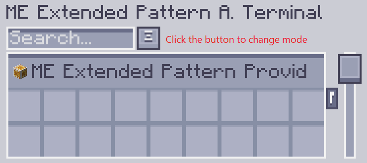
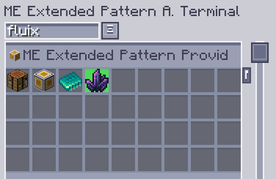

---
navigation:
    parent: epp_intro/epp_intro-index.md
    title: ME拡張型パターンアクセスターミナル
    icon: extendedae:ex_pattern_access_part
categories:
- extended devices
item_ids:
- extendedae:ex_pattern_access_part
- extendedae:wireless_ex_pat
---

# ME拡張型パターンアクセスターミナル

ME拡張型パターンアクセスターミナルは、<ItemLink id="ae2:pattern_access_terminal" />と比較して3つの追加機能があります。

<Row gap="20">
<GameScene zoom="6" background="transparent">
<ImportStructure src="../structure/cable_ex_pattern_terminal.snbt"></ImportStructure>
<IsometricCamera yaw="180"></IsometricCamera>
</GameScene>
<ItemImage id="extendedae:wireless_ex_pat" scale="4"></ItemImage>
</Row>

# ここがスゴイ！拡張型パターンアクセスターミナル！

## より良いパターン検索！

入力/出力材料名でパターンを検索できます。

## パターンの強調表示！

パターンは常にグループとして表示されるため、目的のパターンを見つけるのが難しい場合があります。拡張型パターンアクセスターミナルでは、一致したパターンをGUIで強調表示できるようになりました。

## パターンプロバイダーをワールド上で強調表示！

大規模なクラフト作業を行う際に、どのパターンプロバイダーがスタックしているかを確認するのは面倒です。拡張パターンアクセスターミナルを使用すると、
ワールド内でパターンプロバイダーを強調表示できるので、簡単に見つけることができます。

