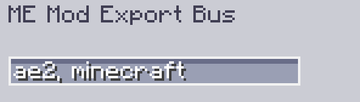

---
navigation:
    parent: epp_intro/epp_intro-index.md
    title: MEエクスポートバス(MOD)
    icon: extendedae:mod_export_bus
categories:
- extended devices
item_ids:
- extendedae:mod_export_bus
---

# MEエクスポートバス(MOD)

<GameScene zoom="8" background="transparent">
  <ImportStructure src="../structure/cable_mod_export_bus.snbt"></ImportStructure>
</GameScene>

MEエクスポートバス(MOD)は、Mod名またはMod IDでフィルタリングできる<ItemLink id="ae2:export_bus" />です。

複数のModをフィルタリングする場合は、複数のMod IDをカンマで区切ってください。

