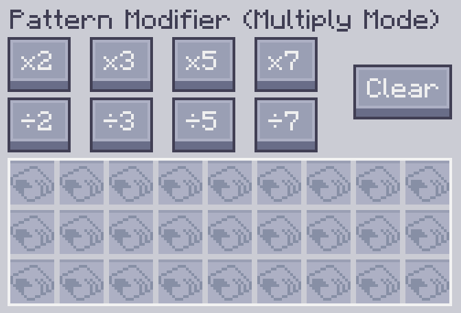
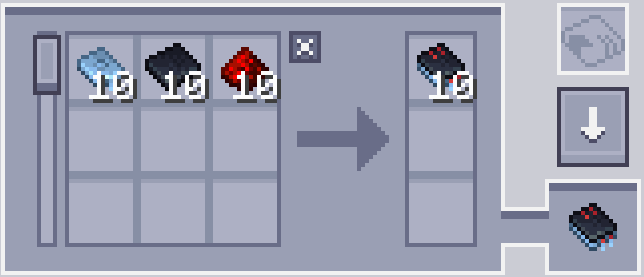
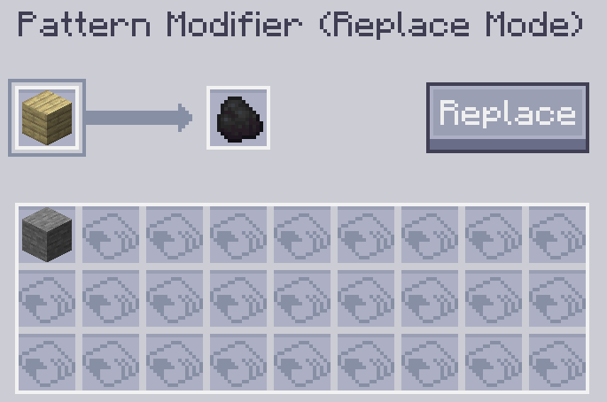
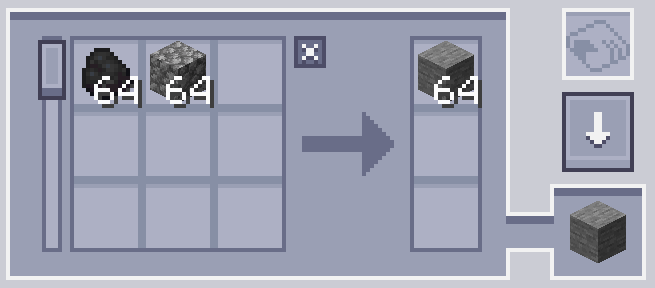
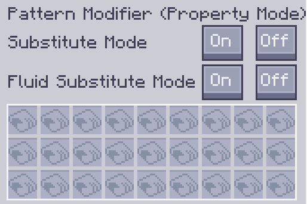
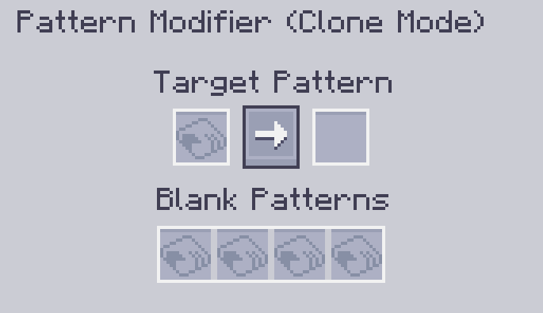

---
navigation:
    parent: epp_intro/epp_intro-index.md
    title: パターン修飾キット
    icon: extendedae:pattern_modifier
categories:
- extended items
item_ids:
- extendedae:pattern_modifier
---

# パターン修飾キット

パターン修飾キットは、パターンを一括で変更するためのツールです。

<ItemImage id="extendedae:pattern_modifier" scale="4"></ItemImage>

右クリックしてGUIを開きます。

## 乗算モード

対応するボタンをクリックすると、処理パターンの入力量と出力量をxで乗算/除算できます。

元のパターン:

10倍した結果:

また、[消去]ボタンをクリックすると、すべてのパターンの内容を消去して空のパターンにすることもできます。

### ヒント:

 - 除算ボタンは、その量が割り切れる場合にのみ機能します。例えば、パターンに入力として丸石が3個必要な場合、3÷2は1.5となるため、÷2ボタンは機能しません。

 - 乗算ボタンには上限(999999)があります。この数値を超える材料の量は計算できません。

## 置換モード

パターンの特定の入力および出力材料を他のアイテムに置き換えます。

スロットAは置き換える物、スロットBは置き換えた物です。

例として、この次の場合だと、シラカバの板材が石炭に置き換えられます。

置換を実行するには、「置き換え」ボタンをクリックします。

## プロパティモード

クラフトパターンの置換と流体置換を変更します(パターンエンコーディングターミナルにあるやつです)

## 複製モード

このモードでは、任意のパターンをコピーできます。

