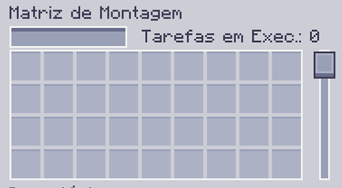

---
navigation:
    parent: epp_intro/epp_intro-index.md
    title: Matriz de Montagem
    icon: extendedae:assembler_matrix_frame
categories:
- extended devices
item_ids:
- extendedae:assembler_matrix_frame
- extendedae:assembler_matrix_wall
- extendedae:assembler_matrix_glass
- extendedae:assembler_matrix_pattern
- extendedae:assembler_matrix_crafter
- extendedae:assembler_matrix_speed
---

# Matriz de Montagem

<Row>
<BlockImage id="extendedae:assembler_matrix_frame" p:formed="true" p:powered="true" scale="5"></BlockImage>
<BlockImage id="extendedae:assembler_matrix_wall" scale="5"></BlockImage>
<BlockImage id="extendedae:assembler_matrix_glass" scale="5"></BlockImage>
</Row>
<Row>
<BlockImage id="extendedae:assembler_matrix_pattern" scale="5"></BlockImage>
<BlockImage id="extendedae:assembler_matrix_crafter" scale="5"></BlockImage>
<BlockImage id="extendedae:assembler_matrix_speed" scale="5"></BlockImage>
</Row>

A Matriz de Montagem é uma estrutura multibloco. É uma combinação de <ItemLink id="ae2:molecular_assembler" /> e <ItemLink id="ae2:pattern_provider" />.
Ela pode executar muitos trabalhos de craft ao mesmo tempo (com <ItemLink id="ae2:crafting_accelerator" /> suficientes na sua rede ME) e economizar canais para você.

## Estrutura

<GameScene zoom="3" background="transparent" interactive={true}>
  <ImportStructure src="../structure/assembler_matrix.snbt"></ImportStructure>
</GameScene>

É um prisma retangular, com comprimentos de aresta entre 3 e 7.
- Arestas compostas por Estrutura da Matriz de Montagem.
- Faces compostas por Parede/Vidro da Matriz de Montagem.
- Interior composto por Núcleo de Padrão/Fabricação/Velocidade da Matriz de Montagem.

Uma Matriz de Montagem válida deve conter pelo menos um núcleo de padrão e um núcleo de fabricação.
Deve ser completamente preenchida e não pode ser oca.
Quando a Matriz de Montagem estiver corretamente formada e energizada, as linhas na Estrutura da Matriz de Montagem ficarão azuis.

## Núcleo da Matriz de Montagem

Existem 3 Núcleos de Matriz de Montagem diferentes.

- Núcleo de Padrão da Matriz de Montagem

A Matriz de Montagem aceita apenas padrões do seu núcleo de padrão. Cada núcleo de padrão fornece 36 slots de padrão para a Matriz de Montagem.

- Núcleo de Fabricação da Matriz de Montagem

A Matriz de Montagem atribuirá as tarefas de fabricação recebidas ao seu núcleo de fabricação. Cada núcleo de fabricação pode executar 8 tarefas de fabricação ao mesmo tempo.

- Núcleo de Velocidade da Matriz de Montagem

É o <ItemLink id="ae2:speed_card" /> para a Matriz de Montagem. 5 núcleos de velocidade permitem que a Matriz de Montagem funcione na velocidade máxima.
Instalar mais de 5 núcleos de velocidade não dará impulso de velocidade extra.

## Interface

Clicar com o botão direito em uma Matriz de Montagem formada e online abrirá sua Interface.

Você pode colocar ou buscar padrões nela, e ver quantas tarefas de fabricação ela está executando.