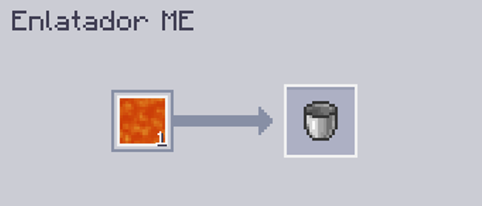

---
navigation:
    parent: epp_intro/epp_intro-index.md
    title: Enlatador ME
    icon: extendedae:caner
categories:
- extended devices
item_ids:
- extendedae:caner
---

# Enlatador ME

<BlockImage id="extendedae:caner" scale="8"></BlockImage>

O Enlatador ME é uma máquina que "enlata" coisas, incluindo fluidos, gás do Mekanism, mana do Botania e até Energia!

O primeiro slot é para o conteúdo de enchimento, e o segundo slot é para o recipiente a ser preenchido.

Ele precisa de energia para funcionar e cada operação custa 80 AE.

Ele apenas enche fluidos por padrão, você precisa instalar o addon correspondente para fazê-lo encher outras coisas.

### Addons suportados:
- Applied Flux
- Applied Mekanistics
- Applied Botanics Addon

## Fabricação Automática com o Enlatador ME

Apenas os lados superior e inferior podem aceitar energia e conectar-se à rede.

<GameScene zoom="6" background="transparent">
  <ImportStructure src="../structure/caner_example.snbt"></ImportStructure>
</GameScene>

Uma configuração simples para o Enlatador ME. O Enlatador ME ejetará automaticamente o item preenchido quando aceitar os ingredientes do <ItemLink id="ae2:pattern_provider" />.

<GameScene zoom="6" background="transparent">
  <ImportStructure src="../structure/caner_auto.snbt"></ImportStructure>
</GameScene>

O padrão deve conter apenas o conteúdo de enchimento e o recipiente a ser preenchido. Aqui estão alguns exemplos:

- Encher balde de água:

- Energizar Tablet de Energia (Requer Applied Flux instalado):

## Esvaziamento

O Enlatador ME também pode drenar coisas de recipientes no Modo Esvaziar. Você precisa inverter as entradas e saídas no padrão.