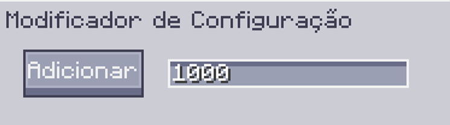

---
navigation:
    parent: epp_intro/epp_intro-index.md
    title: Modificador de Configuração
    icon: extendedae:config_modifier
categories:
- extended items
item_ids:
- extendedae:config_modifier
---

# Modificador de Configuração

O Modificador de Configuração é uma ferramenta para modificação em massa de inventário de configuração.

<ItemImage id="extendedae:config_modifier" scale="4"></ItemImage>

Clique com o botão direito para abrir sua Interface.

## Uso

O Modificador de Configuração pode modificar coisas como o inventário de configuração da interface através de suas 
configurações rapidamente, como definir a quantidade de itens de configuração para o valor máximo ou apenas remover todos eles.

Você pode clicar no dispositivo alvo (bloco ou subparte) no mundo com o Modificador de Configuração para modificar sua configuração.

## Configurações

Ele possui duas configurações principais, o **modo de modificação** e a **quantidade de modificação (X)**.

Você pode clicar no botão para alterar o modo.

- Adicionar/Subtrair/Multiplicar/Dividir: Adiciona/Subtrai/Multiplica/Divide o número da quantidade de configuração por X.
- Maximizar: Define o número da quantidade de configuração para o valor máximo.
- Minimizar: Define o número da quantidade de configuração para o valor mínimo.
- Definir: Define o número da quantidade de configuração para X.
- Limpar: Limpa toda a configuração.