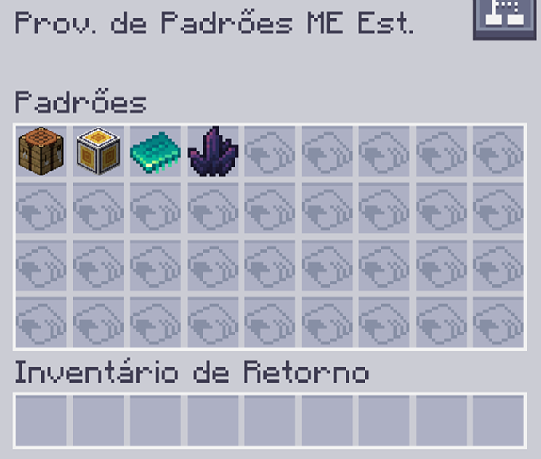

---
navigation:
    parent: epp_intro/epp_intro-index.md
    title: Provedor de Padrões ME Estendido
    icon: extendedae:ex_pattern_provider
categories:
- extended devices
item_ids:
- extendedae:ex_pattern_provider
- extendedae:ex_pattern_provider_part
---

# Provedor de Padrões ME Estendido

<Row gap="20">
<BlockImage id="extendedae:ex_pattern_provider" scale="8"></BlockImage>
<BlockImage id="extendedae:ex_pattern_provider" p:push_direction="up" scale="8"></BlockImage>
<GameScene zoom="8" background="transparent">
  <ImportStructure src="../structure/cable_ex_pattern_provider.snbt"></ImportStructure>
</GameScene>
</Row>

O Provedor de Padrões ME Estendido é um <ItemLink id="ae2:pattern_provider" /> com um inventário de 
padrão maior.

*Quem precisa de sub-rede quando você pode colocar todos os padrões em um bloco.*

