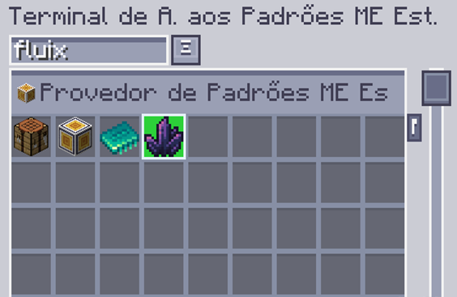
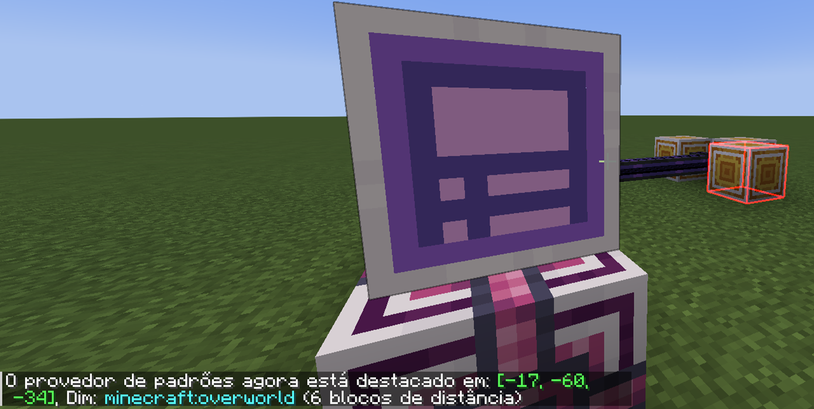

---
navigation:
    parent: epp_intro/epp_intro-index.md
    title: Terminal de Acesso aos Padrões ME Estendido
    icon: extendedae:ex_pattern_access_part
categories:
- extended devices
item_ids:
- extendedae:ex_pattern_access_part
- extendedae:wireless_ex_pat
---

# Terminal de Acesso aos Padrões ME Estendido

O Terminal de Acesso aos Padrões ME Estendido fornece 3 recursos adicionais extras comparado com <ItemLink id="ae2:pattern_access_terminal" />.

<Row gap="20">
<GameScene zoom="6" background="transparent">
<ImportStructure src="../structure/cable_ex_pattern_terminal.snbt"></ImportStructure>
<IsometricCamera yaw="180"></IsometricCamera>
</GameScene>
<ItemImage id="extendedae:wireless_ex_pat" scale="4"></ItemImage>
</Row>

## Melhor Busca de Padrão

Você pode buscar padrão pelo nome dos ingredientes de entrada/saída.

## Destaque de Padrão

Às vezes ainda é difícil encontrar o padrão desejado porque os padrões são sempre exibidos como um grupo. Agora o Terminal de Acesso aos Padrões ME Estendido
pode destacar o padrão correspondente na Interface.

## Destaque de Provedor de Padrões no Mundo

É irritante descobrir qual Provedor de Padrões está travado ao fazer grandes tarefas de fabricação. O Terminal de Acesso aos Padrões ME Estendido
pode destacar o Provedor de Padrões no mundo, para que você possa localizá-lo facilmente.

