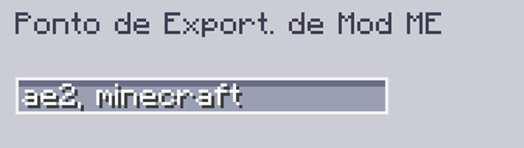

---
navigation:
    parent: epp_intro/epp_intro-index.md
    title: Ponto de Exportação de Mod ME
    icon: extendedae:mod_export_bus
categories:
- extended devices
item_ids:
- extendedae:mod_export_bus
---

# Ponto de Exportação de Mod ME

<GameScene zoom="8" background="transparent">
  <ImportStructure src="../structure/cable_mod_export_bus.snbt"></ImportStructure>
</GameScene>

O Ponto de Exportação de Mod ME é um <ItemLink id="ae2:export_bus" /> que pode ser filtrado por nome do mod ou id do mod.

Use vírgula para separar múltiplos ids de mods caso você queira filtrar múltiplos mods.

