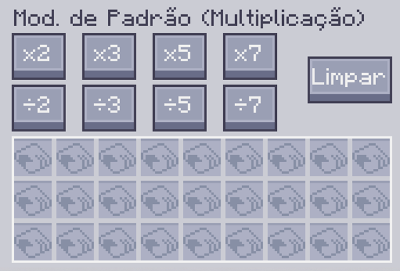
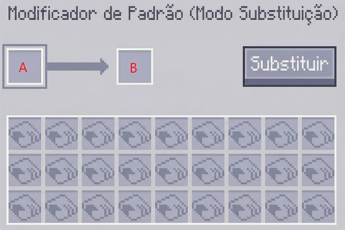
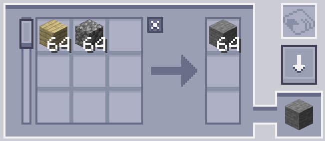
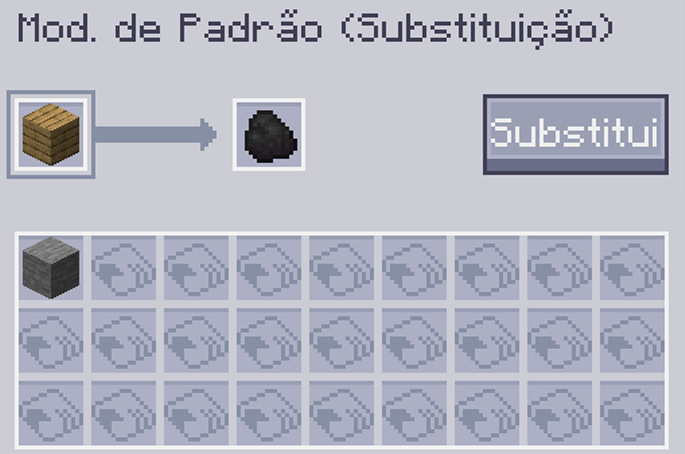
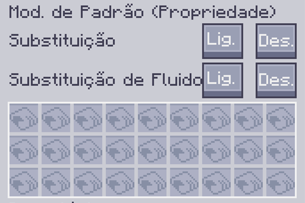
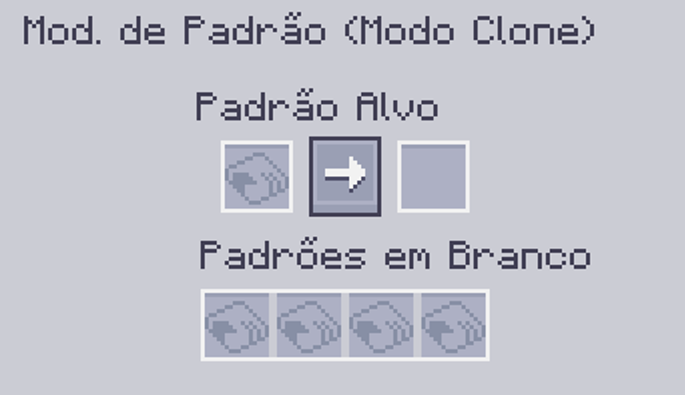

---
navigation:
    parent: epp_intro/epp_intro-index.md
    title: Modificador de Padrão
    icon: extendedae:pattern_modifier
categories:
- extended items
item_ids:
- extendedae:pattern_modifier
---

# Modificador de Padrão

O Modificador de Padrão é uma ferramenta para modificação de padrões em massa.

<ItemImage id="extendedae:pattern_modifier" scale="4"></ItemImage>

Clique com o botão direito nele para abrir sua Interface.

## Modo Multiplicação

Você pode multiplicar/dividir a quantidade de entrada e saída do padrão de processamento por x clicando no botão correspondente. 

Padrão Original:

Após x10:

Ele também pode limpar todo o conteúdo dos padrões e transformá-los em padrões em branco clicando no botão Limpar.

### Notas:

 - O botão de divisão funciona apenas quando sua quantidade é divisível. Por exemplo, o botão ÷2 não funcionará quando o padrão requer 3x
pedregulhos como entrada, porque 3÷2 é 1,5.

 - O botão de multiplicação tem um limite (999999). Ele não pode fazer a quantidade de um único ingrediente ultrapassar esse número.

## Modo Substituição

Substitui certo ingrediente de entrada e saída do padrão por outro item.

O slot A é o que será substituído e o slot B é pelo que o alvo será substituído.

Por exemplo, a configuração a seguir substituirá a tábua por carvão.

Clique no botão Substituir para realizar a substituição.

## Modo Propriedade

Modifica o modo de Substituições e Substituições de Fluido do padrão de fabricação.

## Modo Clone

Você pode copiar qualquer padrão fornecido neste modo.

