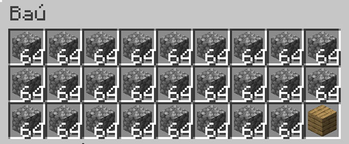

---
navigation:
    parent: epp_intro/epp_intro-index.md
    title: Ponto de Exportação Preciso ME
    icon: extendedae:precise_export_bus
categories:
- extended devices
item_ids:
- extendedae:precise_export_bus
---

# Ponto de Exportação Preciso ME

<GameScene zoom="8" background="transparent">
  <ImportStructure src="../structure/cable_precise_export_bus.snbt"></ImportStructure>
</GameScene>

O Ponto de Exportação Preciso ME exporta itens/fluidos em quantidades especificadas. Ele só exporta se o recipiente puder aceitar totalmente toda a saída.

## Exemplo

Isso significa exportar 3 pedregulhos por operação. Ele para de exportar quando a quantidade de pedregulhos for inferior a 3 na rede.

Ele também para de exportar quando o recipiente alvo não puder conter tudo o que exportou. O baú só pode conter mais 2 pedregulhos agora, então o ponto de exportação para.