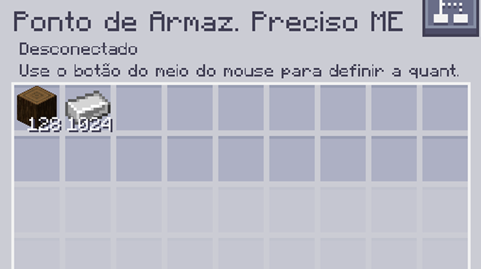

---
navigation:
    parent: epp_intro/epp_intro-index.md
    title: Ponto de Armazenamento Preciso ME
    icon: extendedae:precise_storage_bus
categories:
- extended devices
item_ids:
- extendedae:precise_storage_bus
---

# Ponto de Armazenamento Preciso ME

<GameScene zoom="8" background="transparent">
  <ImportStructure src="../structure/cable_precise_storage_bus.snbt"></ImportStructure>
</GameScene>

O Ponto de Armazenamento Preciso ME é um <ItemLink id="ae2:storage_bus" /> que pode ser filtrado com um número, e ele apenas inserirá itens até esse limite.

