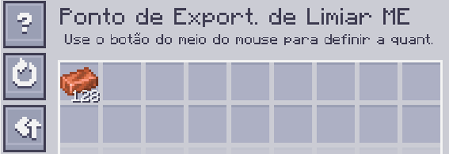
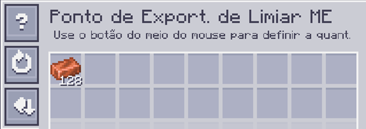

---
navigation:
    parent: epp_intro/epp_intro-index.md
    title: Ponto de Exportação de Limiar ME
    icon: extendedae:threshold_export_bus
categories:
- extended devices
item_ids:
- extendedae:threshold_export_bus
---

# Ponto de Exportação de Limiar ME

<GameScene zoom="8" background="transparent">
  <ImportStructure src="../structure/cable_threshold_export_bus.snbt"></ImportStructure>
</GameScene>

O Ponto de Exportação de Limiar ME funciona quando a quantidade de um item armazenado na rede ME está acima/abaixo do limiar.

## Exemplo

O limiar de cobre é definido para 128, então ele exporta cobre quando o cobre armazenado na rede é superior a 128.

O limiar é o mesmo acima, mas o modo está definido para ABAIXO. ele exporta cobre quando o cobre armazenado é inferior a 128.