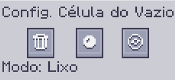

---
navigation:
    parent: epp_intro/epp_intro-index.md
    title: Célula do Vazio ME
    icon: extendedae:void_cell
categories:
- extended items
item_ids:
- extendedae:void_cell
---

# Célula do Vazio ME

Um condensador de bolso no gabinete.

<ItemImage id="extendedae:void_cell" scale="4"></ItemImage>

A Célula do Vazio precisa ser particionada na <ItemLink id="ae2:cell_workbench" /> antes de usar. Ela deletará tudo que
corresponder ao seu filtro ou condensará em <ItemLink id="ae2:matter_ball" /> ou <ItemLink id="ae2:singularity" /> como um <ItemLink id="ae2:condenser" />.

Clique com o botão direito para abrir a Interface de Configuração.

